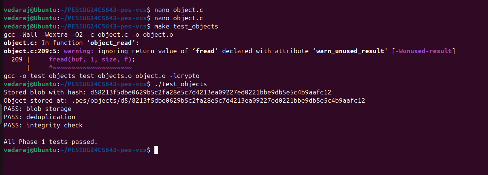
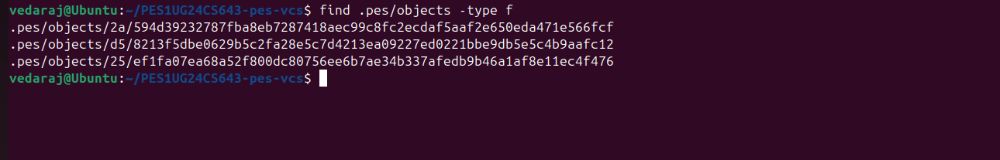
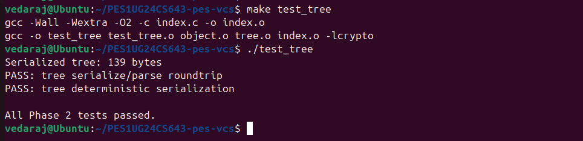
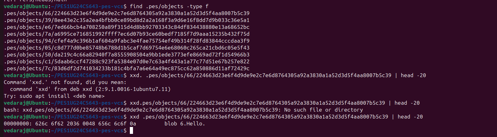
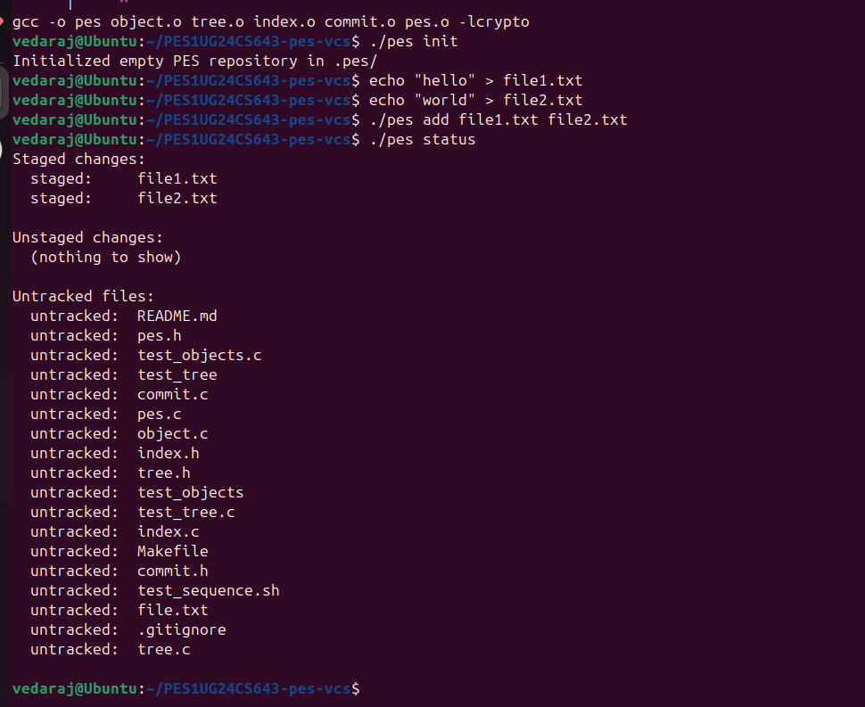
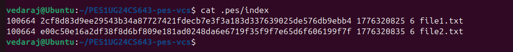
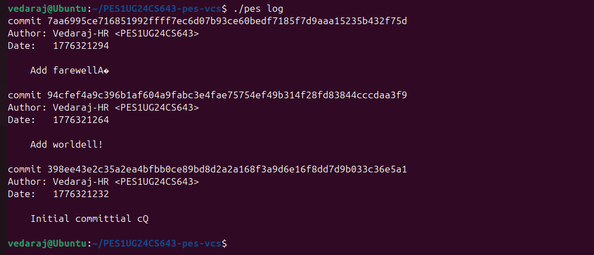
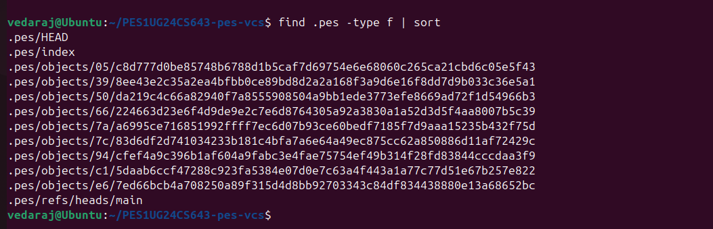
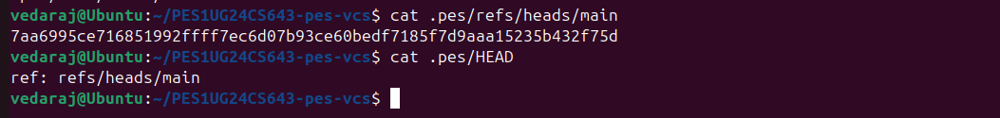

# PES-VCS Lab Report

**Name:** Vedaraj H R
**SRN:** PES1UG24CS643

---

## Phase 1: Object Storage

### Screenshot 1A — test_objects output

### Screenshot 1B — Sharded directory structure

### Explanation

In this phase, I implemented content-addressable storage using SHA-256 hashing. Each object is stored with a header containing its type and size. The hash of the content determines the storage path inside `.pes/objects`. This ensures deduplication and integrity of stored data.

---

## Phase 2: Tree Objects

### Screenshot 2A — test_tree output

### Screenshot 2B — Raw tree object (xxd output)

### Explanation

In this phase, I implemented tree objects to represent directory structures. The function `tree_from_index` builds a hierarchical tree from index entries. It handles nested directories recursively and ensures consistent ordering for deterministic hashing.

---

## Phase 3: Index (Staging Area)

### Screenshot 3A — pes init, add, status

### Screenshot 3B — .pes/index file content

### Explanation

In this phase, I implemented the staging area using a text-based index file. The index stores metadata such as mode, hash, modification time, file size, and file path. Files are staged by computing their hash and updating the index. Atomic writes ensure safe updates.

---

## Phase 4: Commits and History

### Screenshot 4A — pes log output

### Screenshot 4B — .pes directory structure

### Screenshot 4C — HEAD and branch reference

### Explanation

In this phase, I implemented commit creation and history tracking. The `commit_create` function builds a tree from the index and creates a commit object containing metadata like author, timestamp, and message. Each commit points to its parent, forming a history chain.

---

## Phase 5 & 6: Analysis Questions

### Q5.1

To implement `pes checkout <branch>`, the HEAD file must be updated to point to the selected branch reference. The commit hash of the target branch is read from `.pes/refs/heads/<branch>`. The corresponding tree is loaded, and the working directory is updated to match it by creating, modifying, or deleting files. This operation is complex because it must detect uncommitted changes and avoid overwriting user data.

---

### Q5.2

To detect a dirty working directory, we compare the working directory files with the index. For each file, we compute its hash and compare it with the stored hash in the index. If they differ, the file is modified. Then we compare the index version with the target branch’s version. If both differ, checkout must be refused to prevent conflicts and data loss.

---

### Q5.3

In a detached HEAD state, HEAD contains a commit hash instead of a branch reference. New commits can still be created, but they are not associated with any branch. These commits may become unreachable. To recover them, a new branch can be created pointing to the commit hash.

---

### Q6.1

Garbage collection can be implemented using a mark-and-sweep algorithm. First, all reachable objects are identified by traversing from branch references and following commit and tree links. Then, all unreachable objects in the object store are deleted. A hash set can be used to efficiently track reachable objects.

---

### Q6.2

Running garbage collection concurrently with a commit operation is risky because objects created by the commit may not yet be referenced. The garbage collector may mistakenly delete them, leading to corruption. Git avoids this using locking mechanisms and grace periods to ensure safe operation.

---

